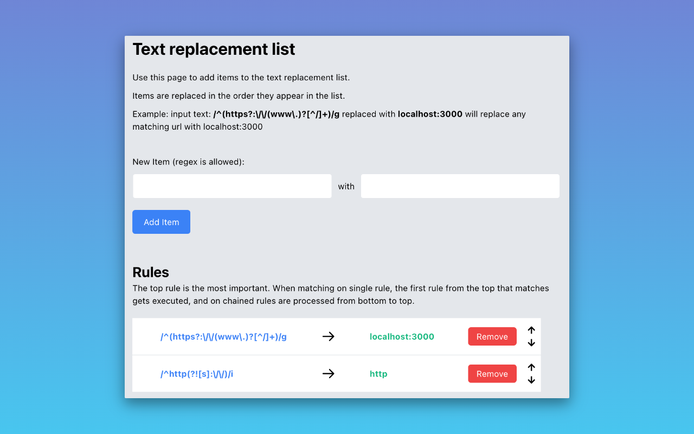
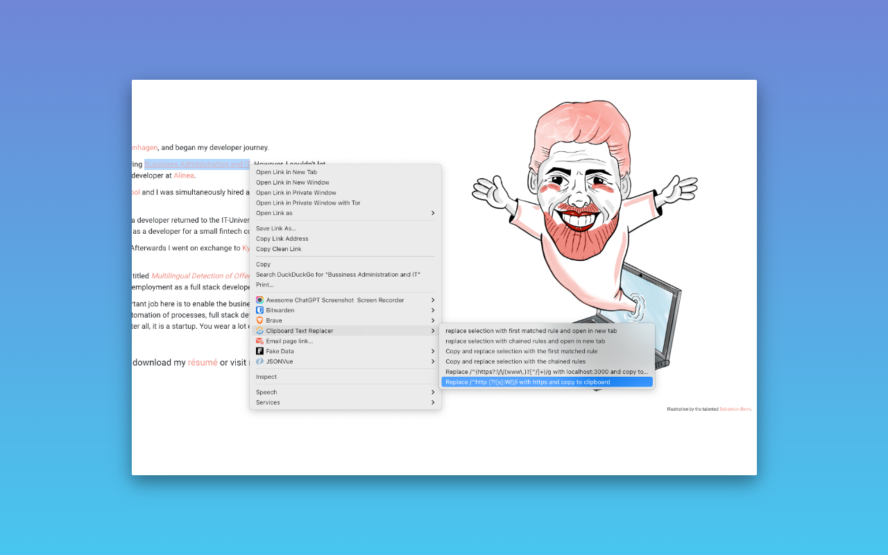
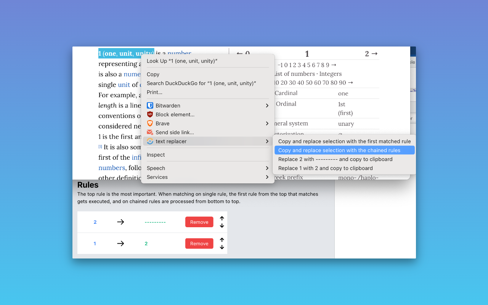
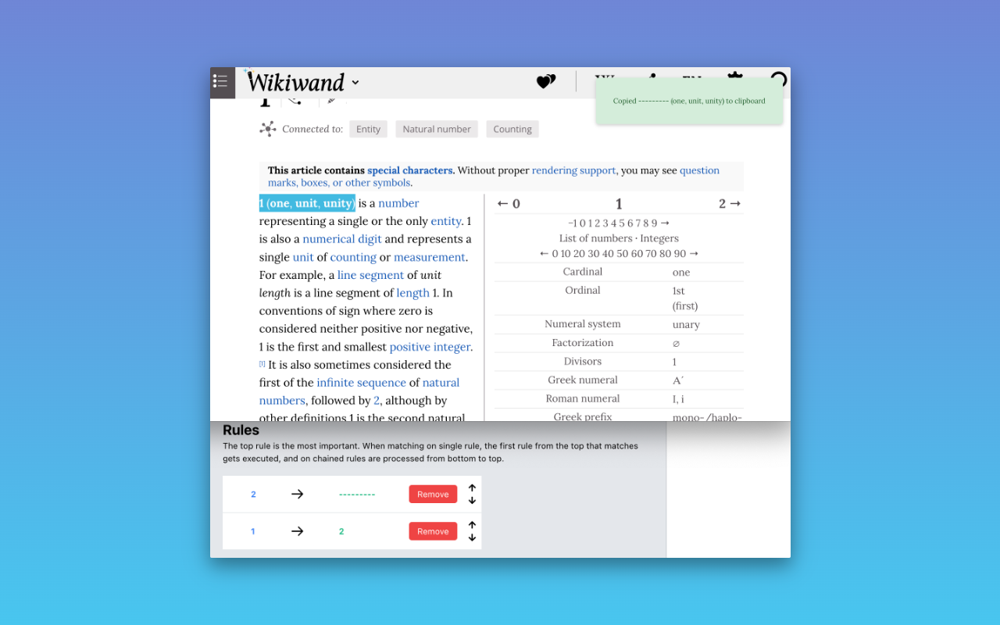

# clipboard-text-replacer

This is an open-source project that I created to facilitate a quick and efficient way to replace specific items in selections and links during the development process. The primary use case was to enable the conversion of production links to point to a local environment. For instance, the extension replaces the regex `/^(https?:\/\/(www\.)?[^/]+)/g` with `localhost:3000`, changing any matching URLs to point to the local environment. Therefore, a URL such as `https://mywebsite.com/users/1` will be transformed into `localhost:3000/users/1`.

The options page is where you set the rules:



In the context menu, you will find two options to replace the text and then open it in a new tab. This can either be the first rule that matches or the chained rules. You also have the same two options for copying the text to the clipboard. Each rule also provides the option to apply a specific rule and copy the replaced text to the clipboard:



The chained rules are processed from bottom to top. For instance, if you have two rules like this:



1 will be transformed into ---------



## Installation

As the extension is currently pending review on the Chrome Webstore, you can install it manually as an unpackaged extension. Follow the steps below to install:

1. Clone the repository: Open your terminal and run the following command:
    ```
    git clone https://github.com/Voldemorten/clipboard-text-replacer.git
    ```
2. Open Google Chrome and navigate to `chrome://extensions`.

3. In the top right corner of the page, toggle on the `Developer mode`.

4. Click on the `Load unpacked` button that appears.

5. Navigate to the directory where you cloned the repository and select the `clipboard-text-replacer` folder.

6. The extension should now be installed and appear in your list of Chrome extensions.

Please note that this is a temporary solution while the extension is under review. Once approved, it will be available for direct installation from the Chrome Webstore.

Enjoy using Clipboard Text Replacer!

PS. This project is open-source, and the repository can be found on <a href="https://github.com/Voldemorten/clipboard-text-replacer">GitHub</a>.
