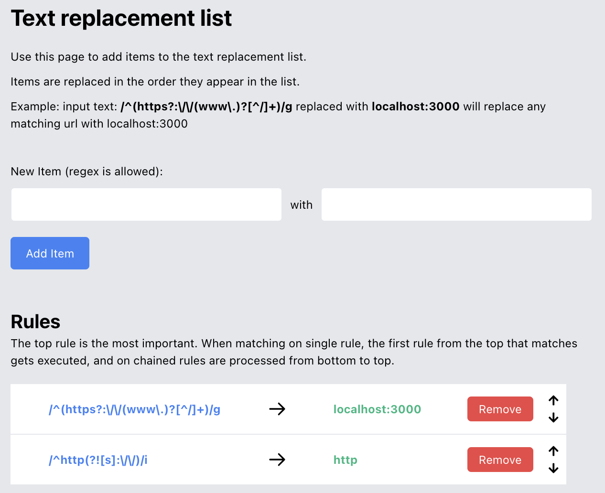
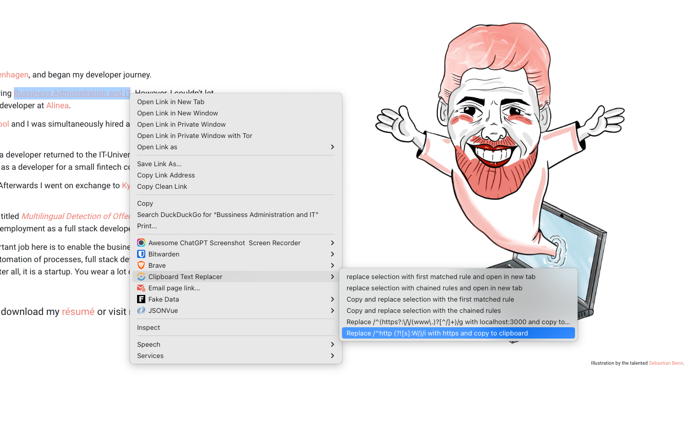

# chrome-url-replacer

This is an open source project, that I created because I needed a quick way to replace certain items in selections and links during my development process. My specific use case, was that I needed to click a lot of links in production, but have them point to my local environment. The example in the extension is that we replace this regex
`/^(https?:\/\/(www\.)?[^/]+)/g` with this `localhost:3000` which changes any matching (most valid urls (probably)) to my local environment. Like `https://mywebsite.com/users/1` will turn into `localhost:3000/users/1`

This is the options page where you set the rules:

And on the context menu, you will two options to replace the text and then open it in a new tab. This can either be the first rule that matches, or the chained rules. You have the same two options for copying the text to clipboard.
For each rule you also have the option to apply a specific rule and copy the replaced text to clipboard:

The chained rules are processed from bottom to top, so if you have two rules like this:

1 will turn into ---------

Enjoy!

PS. This is open source and the repo can be found on <a href="https://github.com/Voldemorten/chrome-url-replacer">github</a>
